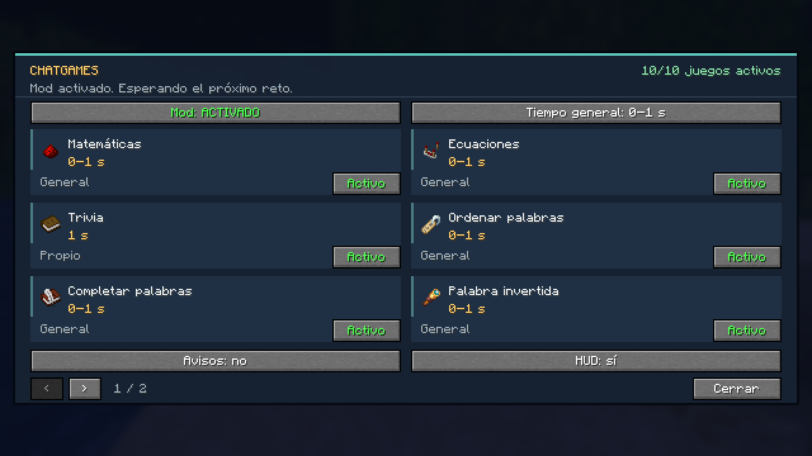
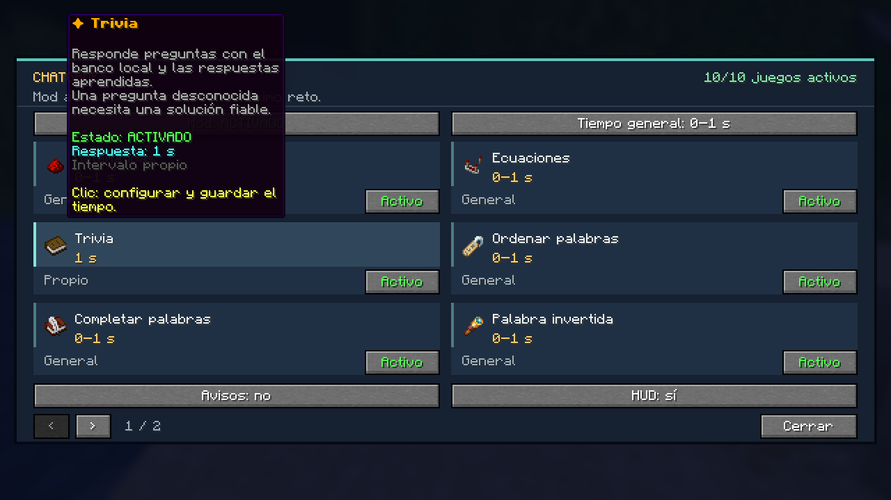
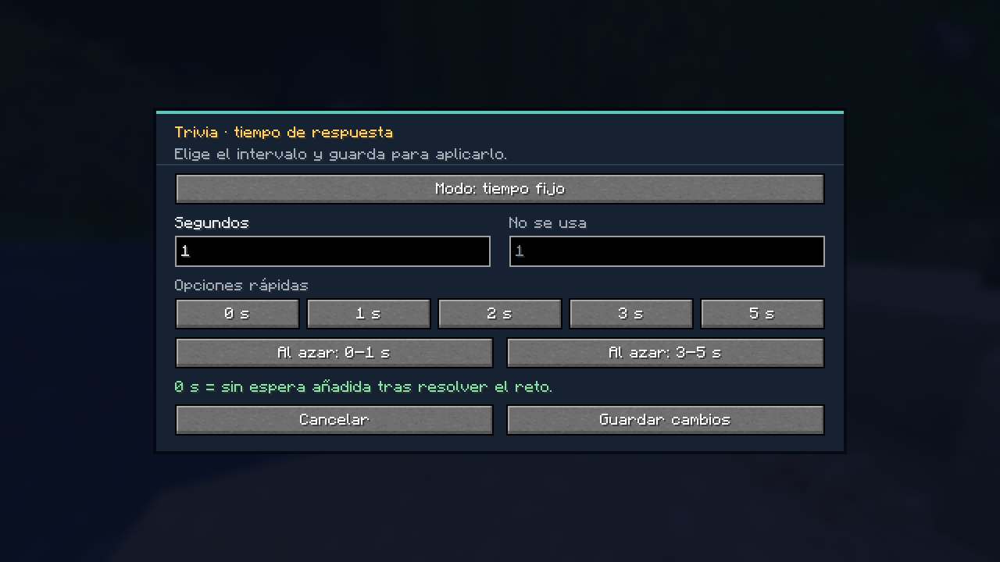

<p align="center">
  
</p>

<h1 align="center">ChatGames Universal Helper</h1>

<p align="center">
  Mod de cliente Fabric para resolver desafíos de ChatGames y configurar sus respuestas mediante una interfaz privada.
</p>

<p align="center">
  <strong>Versión 1.1.0 • Minecraft Java 1.21.11</strong>
</p>

---

## 🦠 Especialmente creado para Infection.fun

**ChatGames Universal Helper** fue desarrollado especialmente para utilizarse en el servidor **Infection.fun**, ayudando al jugador a detectar, resolver y responder automáticamente a los diferentes desafíos de **ChatGames**.

| Información | Valor |
| --- | --- |
| 🌐 Servidor | `Infection.fun` |
| 🔌 Puerto | `19132` |
| 🎮 Minecraft | Java 1.21.11 |
| 🧩 Mod Loader | Fabric |
| 🎯 Sistema | ChatGames |

> **Disponible para todas las modalidades de Infection.fun que utilicen el sistema ChatGames.**

El mod funciona completamente desde el **cliente del jugador**. No es necesario instalar este mod ni un plugin adicional de interfaz en el servidor.

---

## ✨ Características principales

- Interfaz gráfica privada mediante `/cgedit gui`.
- Activación y desactivación individual de minijuegos.
- Activación o pausa global del mod.
- Respuestas con tiempos configurables.
- Posibilidad de responder desde **0 segundos**.
- Intervalos aleatorios de respuesta.
- Tiempo general para todos los juegos.
- Tiempo personalizado para cada minijuego.
- HUD durante los desafíos.
- Avisos locales de respuestas enviadas.
- Configuración persistente después de reiniciar Minecraft.
- Sistema local de respuestas aprendidas.
- Banco de trivias.
- Compatibilidad con distintos tipos de desafíos de ChatGames.
- IA externa opcional cuando está configurada.

---

## 📋 Requisitos

| Componente | Versión |
| --- | --- |
| Minecraft Java | 1.21.11 |
| Java | 21 o superior |
| Fabric Loader | 0.18.4 o superior |
| Fabric API | 0.141.3+1.21.11 utilizada para compilar |

El JAR se instala en el cliente del jugador. La GUI se dibuja localmente y sus comandos se registran como comandos de cliente.

No hace falta instalar un plugin de interfaz adicional en el servidor.

---

## 📦 Instalación

1. Cierra Minecraft.
2. Instala **Fabric Loader** para Minecraft 1.21.11.
3. Instala **Fabric API**.
4. Descarga `chatgames-universal-helper-1.1.0.jar`.
5. Coloca el archivo en la carpeta:

```text
.minecraft/mods/
```

6. Si tienes una versión anterior del mod, retírala y deja solamente una versión instalada.
7. Conserva la carpeta:

```text
config/chatgames-universal-helper/
```

para mantener tus preferencias y respuestas aprendidas.

8. Inicia Minecraft.
9. Entra al servidor.
10. Abre la interfaz mediante:

```text
/cgedit gui
```

También puedes utilizar:

```text
/cgedit menu
```

---

## 🔄 Actualización desde versiones anteriores

Esta actualización conserva los tiempos configurados en la versión **1.0.9**.

Una configuración más antigua recibe la migración previa a un intervalo de **0–1 segundo** una sola vez.

Los minijuegos que el jugador haya pausado no se vuelven a activar automáticamente.

---

# 🖥️ Interfaz privada

Abre la interfaz dentro del juego utilizando:

```text
/cgedit gui
```

o:

```text
/cgedit menu
```

La interfaz solamente se muestra al jugador que tiene instalado el mod.

### Tarjetas de minijuegos

Cada minijuego dispone de su propia tarjeta.

Las tarjetas muestran:

- Objeto representativo.
- Nombre del minijuego.
- Estado actual.
- Tiempo efectivo de respuesta.
- Información mediante lore.
- Ejemplos.
- Si utiliza un tiempo propio o hereda el tiempo general.

Al pasar el cursor sobre una tarjeta puedes consultar más información.

---

### Activo / Pausado

Permite activar o desactivar un minijuego específico.

Cuando un minijuego se pausa:

- Su estado se guarda inmediatamente.
- No responderá nuevos desafíos de ese tipo.
- Una respuesta pendiente puede ser cancelada.

---

### Editor de tiempo

Al hacer clic en una tarjeta se abre el editor de tiempo correspondiente al minijuego.

Puedes elegir entre:

- **Tiempo fijo**
- **Intervalo aleatorio**
- **Usar tiempo general**

Se aceptan valores entre:

```text
0 y 60 segundos
```

También pueden utilizarse decimales:

```text
0.5
0,5
```

o unidades:

```text
500ms
```

Existen opciones rápidas como:

```text
0 segundos
1 segundo
2 segundos
3 segundos
5 segundos
0–1 segundos
3–5 segundos
```

---

### Mod ACTIVADO / EN PAUSA

Permite activar o pausar todas las respuestas automáticas.

Los estados individuales de cada minijuego se conservan.

---

### Tiempo general

Configura el intervalo utilizado por los minijuegos que no tengan un tiempo personalizado.

---

### Avisos

Permite mostrar u ocultar mensajes locales como:

```text
Respuesta enviada
```

Desactivar estos avisos **no desactiva las respuestas automáticas**.

---

### HUD

Permite mostrar u ocultar el panel de información durante un desafío.

---

### Paginación

Las flechas permiten cambiar entre las diferentes páginas de minijuegos.

El número de tarjetas visibles se adapta a la escala de la interfaz de Minecraft.

---

## 💾 Guardado de cambios

El botón **Guardar cambios** valida y almacena la nueva configuración.

Los cambios permanecen después de reiniciar Minecraft.

Si utilizas:

- **Cancelar**
- **Escape**

volverás al menú anterior sin guardar el intervalo que estabas editando.

El tiempo mínimo nunca puede superar al máximo.

Si el guardado falla, el valor anterior se conserva en memoria.

---

## ⚡ Respuestas a 0 segundos

El mod permite configurar:

```text
0s
```

Con **0 segundos**, el mod no añade una espera artificial después de detectar y resolver el desafío.

Sin embargo, todavía intervienen factores como:

- Recepción del mensaje.
- Lectura del chat.
- Agrupación de mensajes.
- Detección del desafío.
- Resolución.
- Procesamiento del cliente.
- Latencia de conexión.

Por esta razón, `0s` significa **sin retraso adicional configurado por el mod**.

Una respuesta que ya fue programada conserva el intervalo que tenía cuando fue creada.

La GUI tampoco pausa el servidor ni el mundo local y el mod puede continuar respondiendo mientras la interfaz está abierta.

---

# 📸 Capturas de la interfaz

### Menú principal



### Información de Trivia



### Editor de tiempo



---

# 🎮 Minijuegos compatibles con la GUI

| Juego | Función |
| --- | --- |
| Matemáticas | Resuelve sumas, restas, multiplicaciones y otras operaciones. |
| Ecuaciones | Resuelve incógnitas de letras y símbolos, incluso en varias líneas. |
| Trivia | Utiliza un banco local y respuestas aprendidas. |
| Ordenar palabras | Resuelve anagramas de una palabra o frase y conserva la capitalización. |
| Completar palabras | Detecta letras faltantes y escribe la respuesta esperada por el servidor. |
| Palabra invertida | Invierte el texto solicitado. |
| Reacción | Escribe el texto indicado por el reto. |
| Texto aleatorio | Conserva exactamente mayúsculas y minúsculas. |
| Clic en el chat | Utiliza el componente pulsable del evento. |
| Adivinar número | Ajusta los intentos según las pistas recibidas. |

---

## Otros modos

La interfaz actual no incorpora:

```text
HOVERABLE
HUNT
MINE
PLACE
FISH
EAT
CRAFT
FURNACE
```

Su implementación anterior permanece fuera del alcance de esta revisión.

---

## 🧠 Sistema de aprendizaje

Las respuestas desconocidas o ambiguas pueden quedar sin enviar cuando el mod no encuentra una solución local suficientemente fiable.

Una IA externa es opcional y solamente se consulta cuando está correctamente configurada.

El banco incluido procede de los desafíos y resultados proporcionados durante el desarrollo.

Los anuncios posteriores del servidor también pueden permitir aprender nuevas respuestas.

---

# ⌨️ Comandos

| Comando | Descripción |
| --- | --- |
| `/cgedit gui` | Abre la interfaz privada. |
| `/cgedit menu` | Abre la interfaz privada. |
| `/cgedit on` | Activa las respuestas automáticas. |
| `/cgedit off` | Pausa las respuestas y cancela las pendientes. |
| `/cgedit game <tipo> on/off` | Activa o desactiva un juego específico. |
| `/cgedit settime` | Muestra los intervalos configurados. |
| `/cgedit settime 0s` | Configura el tiempo general sin espera añadida. |
| `/cgedit settime random 0s 1s` | Configura el intervalo general entre 0 y 1 segundo. |
| `/cgedit settime trivia 1s` | Configura un tiempo propio para Trivia. |
| `/cgedit settime variable random 3s 5s` | Configura un rango propio para ecuaciones. |
| `/cgedit settime math default` | Hace que Matemáticas vuelva a utilizar el tiempo general. |
| `/cgedit stats on/off` | Activa o desactiva los avisos locales de respuestas enviadas. |
| `/cgedit debug on/off` | Muestra detalles de detección y envío. |
| `/cgedit status` | Muestra el estado del mod. |
| `/cgedit last` | Muestra información del último reto. |
| `/cgedit cache stats` | Muestra la cantidad de entradas guardadas. |
| `/cgedit ai status` | Muestra el estado de la IA opcional. |
| `/cgedit test <tipo> <texto>` | Prueba una solución sin enviarla al servidor. |
| `/cgedit simulate <texto>` | Prueba la detección sin enviar una respuesta. |
| `/cgedit testlog` | Ejecuta un diagnóstico del registro leído. |
| `/cgedit help 1` | Primera página de ayuda. |
| `/cgedit help 2` | Segunda página de ayuda. |
| `/cgedit help 3` | Tercera página de ayuda. |

---

## 🎲 Configuración especial de RANDOM

El modo `RANDOM` utiliza una sintaxis propia.

Para establecer un tiempo fijo:

```text
/cgedit settime random 0s
```

Para configurar un rango propio:

```text
/cgedit settime random random 0s 1s
```

Mientras que:

```text
/cgedit settime random 0s 1s
```

continúa configurando el rango **general**.

Los minijuegos que tengan un intervalo propio conservarán ese intervalo aunque el tiempo general sea modificado.

---

# 📁 Archivos de configuración

Los archivos se guardan en:

```text
config/chatgames-universal-helper/
```

### `config.json`

Contiene:

- Activación general.
- Estado de los modos.
- Tiempo general.
- Intervalos personalizados.
- HUD.
- Avisos.

### `trivia.json`

Contiene respuestas personales de Trivia.

### `trivia-cache.json`

Contiene respuestas aprendidas de Trivia.

### `word-cache.json`

Contiene respuestas aprendidas relacionadas con palabras.

### `words-es.txt`

Vocabulario personal en español.

### `words-en.txt`

Vocabulario personal en inglés.

---

La GUI modifica los mismos ajustes que los comandos.

Puedes ampliar manualmente tus preguntas y palabras.

Después de modificar los archivos manualmente, reinicia Minecraft.

> ⚠️ No subas configuraciones personales, registros completos, tokens, claves de API ni credenciales al repositorio.

---

# 🛠️ Compilar el mod

El proyecto incluye **Gradle Wrapper 9.2.1**.

Es necesario tener **Java 21** instalado.

## Linux / macOS

```bash
chmod +x gradlew
./gradlew build
```

## Windows

```powershell
.\gradlew.bat build
```

El JAR instalable se genera en:

```text
build/libs/chatgames-universal-helper-1.1.0.jar
```

El archivo:

```text
*-sources.jar
```

contiene el código fuente y **no debe instalarse en la carpeta `mods`**.

El comando `build`:

- Compila el proyecto.
- Ejecuta las pruebas JUnit.
- Remapea el mod para Minecraft.

Para iniciar el cliente de desarrollo:

```bash
./gradlew runClient
```

Este proceso requiere un entorno gráfico y puede descargar los recursos necesarios del juego.

---

# 📤 Publicar en GitHub

Para publicar una nueva versión:

1. Descomprime el ZIP del código fuente.
2. Sube el contenido de la carpeta del proyecto.
3. Incluye:

```text
src/
gradle/
gradlew
gradlew.bat
README.md
LICENSE
WORDLIST_NOTICE.md
docs/
.gitignore
.github/
build.gradle
gradle.properties
settings.gradle
```

No subas:

```text
build/
.gradle/
run/
logs/
configuraciones personales
```

El archivo `.gitignore` ya excluye los elementos que no deben formar parte del repositorio.

---

## GitHub Actions

El workflow:

```text
.github/workflows/build.yml
```

compila el proyecto y ejecuta las pruebas cuando se realiza un `push` o se abre un `pull request`.

---

## 📥 Crear una Release

Para la versión actual utiliza la etiqueta:

```text
v1.1.0
```

Nombre recomendado:

```text
ChatGames Universal Helper v1.1.0
```

Adjunta como archivo descargable:

```text
chatgames-universal-helper-1.1.0.jar
```

Los usuarios deben descargar el `.jar`, no los archivos automáticos:

```text
Source code (zip)
Source code (tar.gz)
```

---

# 📂 Estructura del proyecto

### `gui/`

Tarjetas, paginación, editor y borrador de tiempos.

### `command/`

Comandos de cliente, ayuda y autocompletado.

### `game/`

Detección, sesiones, programación y cancelación de respuestas.

### `solver/`

Matemáticas, ecuaciones, Trivia y palabras.

### `config/`

Preferencias, persistencia y migraciones.

### `chat/`

Funciones relacionadas con el envío y procesamiento del chat.

### `log/`

Lectura y análisis de registros.

### `hud/`

Panel de información en pantalla.

### `ai/`

Integración opcional con IA.

### `src/test/`

Pruebas de solucionadores, registros, cancelación y configuración de la GUI.

---

# 🔐 Seguridad

El proyecto no contiene tokens ni claves de API.

La IA opcional obtiene la clave mediante una variable de entorno configurada por el usuario.

Nunca publiques:

- Tokens.
- Contraseñas.
- Claves de API.
- Configuraciones privadas.
- Logs que contengan información sensible.

---

# 📜 Licencia y atribuciones

El código de **ChatGames Universal Helper** se distribuye bajo la licencia **MIT**.

Consulta:

[LICENSE](LICENSE)

Los diccionarios ampliados contienen contenido de terceros bajo **CC BY-SA 4.0**.

Las atribuciones correspondientes se encuentran en:

[WORDLIST_NOTICE.md](WORDLIST_NOTICE.md)

El archivo:

[ANALISIS_LOGS_ES.md](ANALISIS_LOGS_ES.md)

conserva el análisis histórico de los retos incorporados en la versión 1.0.7.

---

# ✅ Verificación de la versión 1.1.0

La versión **1.1.0** cuenta con:

- **49 pruebas JUnit aprobadas**.
- Sin fallos.
- Sin pruebas omitidas.

La interfaz también fue ejecutada en **Minecraft Java 1.21.11** y revisada utilizando dos tamaños de ventana.

Se comprobaron:

- Lore de las tarjetas.
- Guardado de intervalos.
- Cancelación de cambios.
- Pausa individual de minijuegos.
- Pausa global.
- Persistencia después de reiniciar.
- Rangos inválidos.
- Paginación.

Las capturas almacenadas en:

```text
docs/images/
```

proceden de esa ejecución del cliente.

---

<p align="center">
  
</p>

<p align="center">
  <strong>ChatGames Universal Helper v1.1.0</strong>
</p>

<p align="center">
  Especialmente creado para <strong>Infection.fun</strong> • Puerto <strong>19132</strong>
</p>
